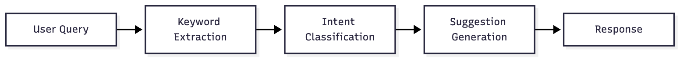
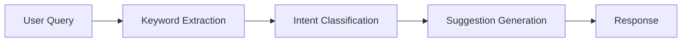

# Promptweave

Proactively suggest relevant next steps in CLI interactions to reduce the 'blank page' problem.

# Code Intent MVP

A simple classifier for code-related intents.

## Usage
python -c "from main import demo; demo()"

## Tests
pytest -q

## Architecture

Mermaid source

